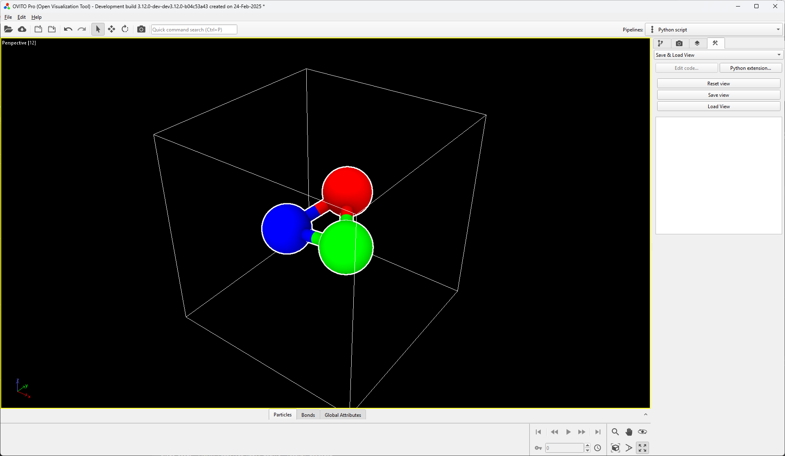

# Save & Load View
A small utility that allows users to save and load the view in the active viewport. Additionally, the view can be reset to match the default perspective view when starting a new OVITO session.



| Button         | Description                                                                                            |
|----------------|--------------------------------------------------------------------------------------------------------|
| **Reset View** | Resets the active viewport to the default perspective view, as seen when starting a new OVITO session. |
| **Save View**  | Saves the current view in the active viewport, allowing it to be restored later.                       |
| **Load View**  | Restores the previously saved view in the active viewport.                                             |

## Installation
- From the OVITO Pro using the [extensions GUI](https://www.ovito.org/docs/current/advanced_topics/python_extensions.html#topics-python-extensions)
- OVITO Pro [integrated Python interpreter](https://docs.ovito.org/python/introduction/installation.html#ovito-pro-integrated-interpreter):
  ```
  ovitos -m pip install --user git+https://github.com/nnn911/ResetViewportView.git
  ``` 
  The `--user` option is recommended and [installs the package in the user's site directory](https://pip.pypa.io/en/stable/user_guide/#user-installs).

- Other Python interpreters or Conda environments:
  ```
  pip install git+https://github.com/nnn911/ResetViewportView.git
  ```

## Technical information / dependencies
- Tested on OVITO version 3.12.0

## Contact
Daniel Utt utt@ovito.org
